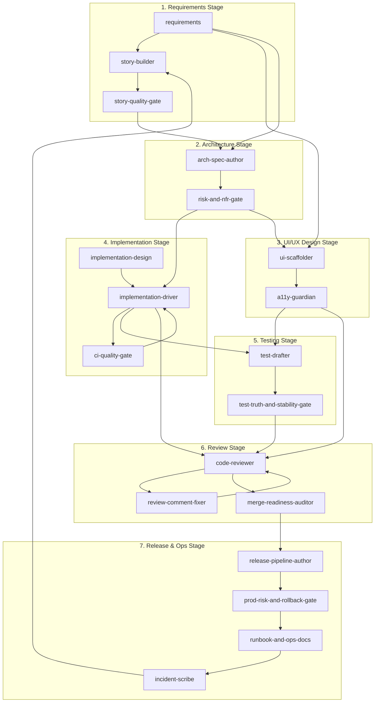

# Custom Agent Workflow Diagram

This document describes the complete workflow of custom GitHub Copilot agents across the software development lifecycle.

______________________________________________________________________

## Agent Inventory

| #  | Agent                              | Type    | Lifecycle Stage      |
|----|------------------------------------|---------|--------------------|
| 1  | `requirements`                     | Builder | 1. Requirements    |
| 2  | `story-builder`                    | Builder | 1. Requirements    |
| 3  | `story-quality-gate`               | Gate    | 1. Requirements    |
| 4  | `ui-scaffolder`                    | Builder | 2. UI/UX Design    |
| 5  | `a11y-guardian`                    | Gate    | 2. UI/UX Design    |
| 6  | `arch-spec-author`                 | Builder | 3. Architecture    |
| 7  | `risk-and-nfr-gate`                | Gate    | 3. Architecture    |
| 8  | `implementation-design`            | Builder | 4. Implementation  |
| 9  | `implementation-driver`            | Builder | 4. Implementation  |
| 10 | `ci-quality-gate`                  | Gate    | 4. Implementation  |
| 11 | `test-drafter`                     | Builder | 5. Testing         |
| 12 | `test-truth-and-stability-gate`    | Gate    | 5. Testing         |
| 13 | `code-reviewer`                    | Gate    | 6. Review          |
| 14 | `review-comment-fixer`             | Builder | 6. Review          |
| 15 | `merge-readiness-auditor`          | Gate    | 6. Review          |
| 16 | `release-pipeline-author`          | Builder | 7. Release & Ops   |
| 17 | `prod-risk-and-rollback-gate`      | Gate    | 7. Release & Ops   |
| 18 | `runbook-and-ops-docs`             | Builder | 7. Release & Ops   |
| 19 | `incident-scribe`                  | Builder | 7. Release & Ops   |

______________________________________________________________________

## Complete Workflow Diagram

```
┌─────────────────────────────────────────────────────────────────────────────┐
│                        SDLC AGENT WORKFLOW                                  │
└─────────────────────────────────────────────────────────────────────────────┘

1. REQUIREMENTS STAGE
   requirements ──┬──> story-builder ──> story-quality-gate ──┐
                  ├──> ui-scaffolder                          │
                  └──> arch-spec-author <─────────────────────┘

   � INPUTS:
   • Raw ideas, stakeholder requests, or problem statements
   • Business goals and success criteria
   • Existing documentation and domain context
   • Constraints (time, budget, compliance, platform)

   📤 OUTPUTS:
   • Feature one-pagers with problem statements and success metrics
   • INVEST-compliant user stories with acceptance criteria (Given/When/Then)
   • Risk register and non-functional requirements (NFRs)
   • Definition of Ready (DoR) validated backlog items

2. ARCHITECTURE STAGE
   arch-spec-author ──> risk-and-nfr-gate ──┬──> implementation-driver
                                            └──> ui-scaffolder

   📥 INPUTS:
   • Feature one-pagers and validated user stories (from Requirements)
   • Acceptance criteria and NFRs (from Requirements)
   • Risk register (from Requirements)
   • Existing codebase patterns and conventions

   📤 OUTPUTS:
   • Architecture brief (context, goals, constraints, quality attributes)
   • API contracts (OpenAPI/JSON Schema) with error models
   • Data models and migration strategies
   • Mermaid/C4 diagrams (context, container, sequence)
   • Architecture Decision Records (ADRs)
   • Threat model and security review

3. UI/UX DESIGN STAGE
   ui-scaffolder ──> a11y-guardian ──> test-drafter
                                  └──> code-reviewer

   📥 INPUTS:
   • API contracts and data models (from Architecture)
   • User stories with UI-related acceptance criteria (from Requirements)
   • Design specs, wireframes, or mockups (external)
   • Existing design system and component library

   📤 OUTPUTS:
   • UI contract (routes, components, states, responsive requirements)
   • Component scaffolds (React/TS) with loading/empty/error states
   • Typed mock data and fixtures
   • Storybook stories for all component states
   • Accessibility audit report (WCAG compliance)

4. IMPLEMENTATION STAGE
   implementation-driver ──┬──> test-drafter
                          ├──> ci-quality-gate (on failures)
                          └──> code-reviewer

   📥 INPUTS:
   • API contracts and data models (from Architecture)
   • ADRs and architecture diagrams (from Architecture)
   • UI scaffolds and component contracts (from UI/UX Design)
   • User stories with acceptance criteria (from Requirements)

   📤 OUTPUTS:
   • Production code changes (small, focused commits)
   • Implementation following contracts/specs
   • Error handling and validation logic
   • Logging and observability hooks
   • PR-ready branches with clear descriptions

5. TESTING STAGE
   test-drafter ──> test-truth-and-stability-gate ──> code-reviewer

   📥 INPUTS:
   • Production code changes (from Implementation)
   • API contracts for contract testing (from Architecture)
   • Acceptance criteria and edge cases (from Requirements)
   • UI components and states (from UI/UX Design)

   📤 OUTPUTS:
   • Unit tests for business logic
   • Integration tests for API contracts and DB boundaries
   • E2E tests for critical user paths
   • Deterministic fixtures and test data
   • Coverage reports mapped to acceptance criteria

6. REVIEW STAGE
   code-reviewer ──> review-comment-fixer ──> merge-readiness-auditor
                                                      │
   📥 INPUTS:                                         │
   • PR with code changes (from Implementation)       │
   • Test suite and coverage reports (from Testing)   │
   • Architecture specs for contract verification (from Architecture)
   • User stories for acceptance validation (from Requirements)
                                                      │
   📤 OUTPUTS:                                        │
   • Pre-review report (security, performance, quality, design)
   • Review comment fixes with minimal diffs
   • Merge readiness report (CI status, approvals, conversations)
   • Approved PR ready for merge
                                                      │
7. RELEASE & OPS STAGE                                ▼
   release-pipeline-author <───────────────────────────┘
          │
          ├──> prod-risk-and-rollback-gate
          │           │
          │           └──> runbook-and-ops-docs
          │                       │
          │                       └──> incident-scribe (on incidents)
          │                                   │
          └───────────────────────────────────┴──> story-builder (follow-ups)

   📥 INPUTS:
   • Approved and merged PR (from Review)
   • Architecture specs for deployment context (from Architecture)
   • NFRs for SLO/monitoring requirements (from Requirements)
   • Risk register for rollback planning (from Requirements/Architecture)

   📤 OUTPUTS:
   • GitHub Actions workflows (build, test, deploy)
   • Environment configurations with approval gates
   • Release plan with rollback triggers
   • Risk assessment report (blast radius, irreversible actions)
   • Deployment runbooks with copy-pasteable commands
   • On-call notes and troubleshooting guides
   • Incident timelines and postmortem documents (when needed)
```

______________________________________________________________________

## Mermaid Diagram



______________________________________________________________________

## Iterative Loops

The workflow supports iteration at multiple points:

| Loop                | Trigger                     | Flow                                                           |
|---------------------|-----------------------------|----------------------------------------------------------------|
| Story Refinement    | Quality issues found        | `story-quality-gate` → `story-builder`                        |
| Architecture Update | Risk/NFR gaps               | `risk-and-nfr-gate` → `arch-spec-author`                     |
| Accessibility Fix   | A11y audit fails            | `a11y-guardian` → `ui-scaffolder`                            |
| Test Revision       | Low signal tests            | `test-truth-and-stability-gate` → `test-drafter`             |
| Review Fix          | Comments to address         | `code-reviewer` → `review-comment-fixer` → `code-reviewer`   |
| Incident Follow-up  | Post-incident actions       | `incident-scribe` → `story-builder`                          |

______________________________________________________________________

## Stage Entry Points

Different scenarios have different entry points:

| Scenario                    | Start Agent                         | Path               |
|-----------------------------|------------------------------------|-------------------|
| New feature from idea       | `requirements`                      | Full lifecycle    |
| Design-ready feature        | `ui-scaffolder` or `arch-spec-author` | Skip requirements |
| Bug fix                     | `implementation-driver`             | Skip design stages|
| Test coverage improvement   | `test-drafter`                      | Testing only      |
| Hotfix/emergency            | `implementation-driver` → `code-reviewer` | Fast path    |
| Incident response           | `incident-scribe`                   | Ops path          |

______________________________________________________________________

## Agent Responsibilities Summary

### Builder Agents (Create artifacts)

- **requirements**: Feature one-pagers, acceptance criteria, risk analysis
- **story-builder**: INVEST-compliant user stories
- **ui-scaffolder**: UI components, mock data, Storybook stories
- **arch-spec-author**: API contracts, diagrams, ADRs, data models
- **implementation-design**: Technical specs without code
- **implementation-driver**: Production code changes
- **test-drafter**: Unit, integration, and E2E tests
- **review-comment-fixer**: Implements reviewer feedback
- **release-pipeline-author**: CI/CD workflows, deployment scripts
- **runbook-and-ops-docs**: Operational documentation
- **incident-scribe**: Incident timelines, postmortems

### Gate Agents (Quality control)

- **story-quality-gate**: INVEST validation, DoR checks
- **a11y-guardian**: Accessibility audits
- **risk-and-nfr-gate**: Security, threat model, NFR review
- **ci-quality-gate**: CI failure analysis and fixes
- **test-truth-and-stability-gate**: Test quality validation
- **code-reviewer**: Pre-merge code review
- **merge-readiness-auditor**: Merge criteria verification
- **prod-risk-and-rollback-gate**: Release safety review
